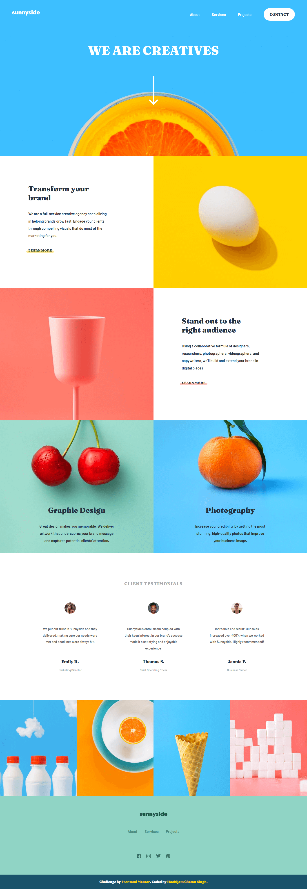

# Frontend Mentor - Sunnyside agency landing page solution

This is a solution to the [Sunnyside agency landing page challenge on Frontend Mentor](https://www.frontendmentor.io/challenges/sunnyside-agency-landing-page-7yVs3B6ef). Frontend Mentor challenges help you improve your coding skills by building realistic projects.

## Table of contents

- [Overview](#overview)
  - [The challenge](#the-challenge)
  - [Screenshot](#screenshot)
  - [Links](#links)
- [My process](#my-process)
  - [Built with](#built-with)
  - [What I learned](#what-i-learned)
  - [Continued development](#continued-development)
  - [Useful resources](#useful-resources)
- [Author](#author)

## Overview

### The challenge

Users should be able to:

- View the optimal layout for the site depending on their device's screen size
- See hover states for all interactive elements on the page

### Screenshot



### Links

- Solution URL: [Sunnyside Agency Landing Page Solution](https://github.com/chetanhaobijam/Sunnyside_Agency_Landing_Page)
- Live Site URL: [Sunnyside Agency Landing Page Live Site](https://chetanhaobijam.github.io/Sunnyside_Agency_Landing_Page/)

## My process

### Built with

- Semantic HTML5 markup
- Flexbox
- CSS Grid
- SCSS

### What I learned

I learned more about SCSS and how to control Navigation Menu using Javascript when viewed on mobile screen. I learned more about CSS Positioning. I learned how we can use DOM Manipulation to change the style of element(s). I learned how to use html "picture" tag to show different images on different screens.

```html
<picture>
  <source
    srcset="./images/mobile/image-gallery-milkbottles.jpg"
    media="(max-width: 576px)"
  />
  <source srcset="./images/desktop/image-gallery-milkbottles.jpg" />
  
</picture>
```

```css
main .hero img {
  width: 4ch;
  position: relative;
  top: 80px;
}
```

```js
navIcon.addEventListener("click", (e) => {
  navItemsContainer.classList.toggle("display");
});

for (let i = 0; i < socialSvgs.length; i++) {
  socialSvgs[i].addEventListener("mouseenter", () => {
    svgPath[i].classList.add("svg-white");
  });
  socialSvgs[i].addEventListener("mouseleave", () => {
    svgPath[i].classList.remove("svg-white");
  });
}
```

### Continued development

I still have lots to learn about Frontend Development. I still need to do more projects to be a better Developer in the future. And now I think I am ready to do more JS related Frontend Projects.

### Useful resources

- [W3Schools](https://www.w3schools.com) - I learn Basic SASS from its SASS lessons.
- [Traversy Media SASS Course Video](https://www.youtube.com/watch?v=nu5mdN2JIwM) - Great Video for learning SASS.

## Author

- Frontend Mentor - [@chetanhaobijam](https://www.frontendmentor.io/profile/chetanhaobijam)
- Twitter - [@chetanhaobijam](https://www.twitter.com/chetanhaobijam)
